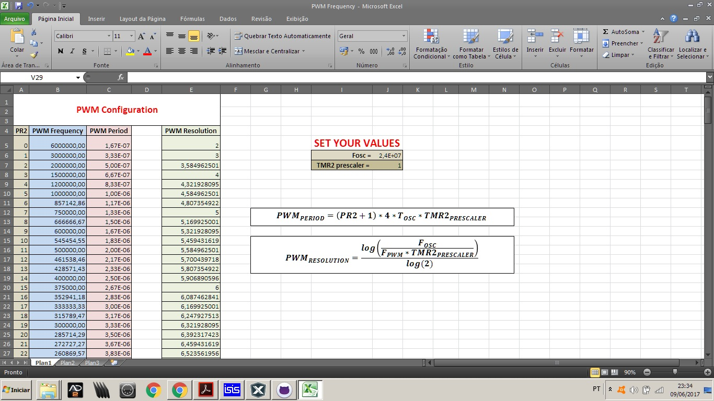

#PWM com Módulo CCP

Configure o PWM no arquivo `PWM.h` alterando os valores dos registradores pertinentes.

Para facilitar abra a [tabela](https://github.com/AsafeSilva/PIC/blob/master/PIC16F628A/PWM/PWM%20Frequency.xlsx),
e insira os valores do `F_osc`(Frequência do oscilador) e do `TMR2_prescaler` (Prescaler do Timer2).
Feito isso, escolha o valor do registrador `PR2` de acordo com a frequência do PWM desejada (observe a resolução do PWM).

Para mais detalhes, leita o datasheet!

