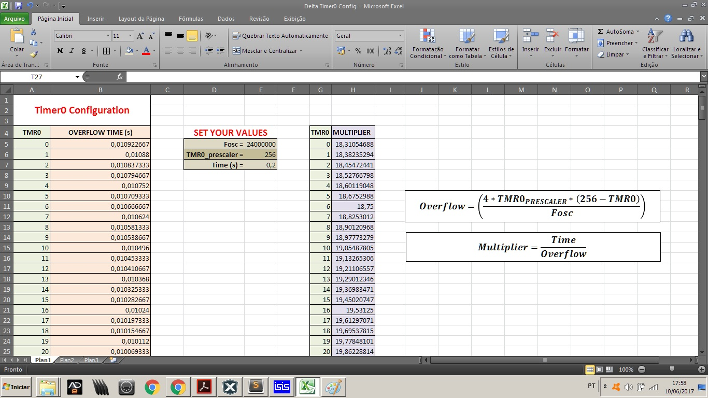

# Oscilador com Timer0

Simples oscilador de 2.5Hz (pode-se configurar qualquer valor) sendo gerado pelo Timer0 no modo de 8 bits.

Para facilitar o cálculo do Timer0 abra a [tabela](https://github.com/AsafeSilva/PIC/blob/master/PIC18F4550/Blink_TMR0%20%5B8%20bits%5D/Timer0%20Config.xlsx) e insira os valores do `Fosc` (Frequência do oscilador) e do `TMR0_prescaler` (Prescaler do Timer0).

Feito isso, escolha o valor do registrado `TMR0` de acordo com o tempo de estouro (overflow) do Timer0.

Caso o tempo de estouro seja muito pequeno, insira o valor do intervalo em `Time` (Intervalo da interrupção [1/2F ou T/2, onde F é a frequência e T o período]) e escolha o multiplicador mais preciso para seu valor de `Time` (observe o valor do TMR0).

Para mais detalhes, consulte o datasheet!

